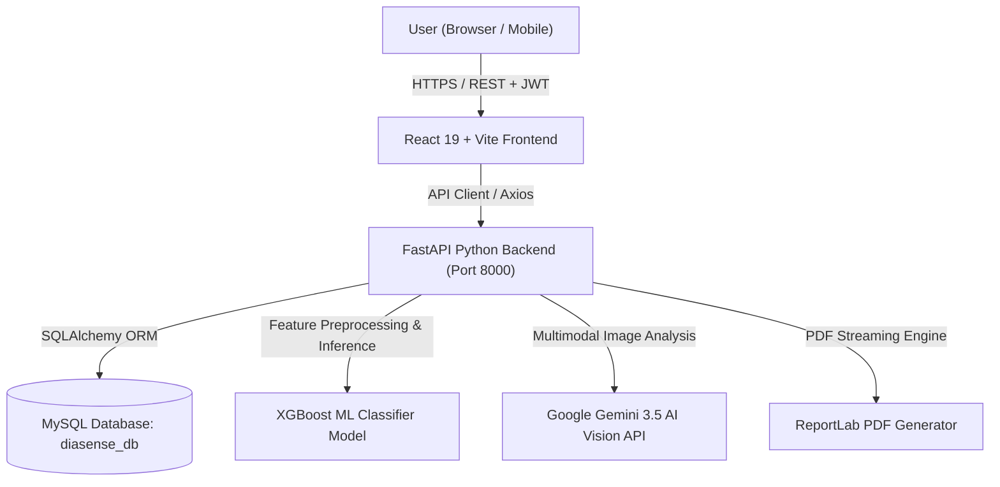

# 🎓 DiaSense AI — Complete Project Presentation & Viva Defense Guide

---

## 📌 1. Project Overview & Executive Summary

* **Project Title:** **DiaSense AI** — AI-Assisted Diabetes Risk Screening, Clinical Explainability & Personalized Metabolic Health Platform.
* **Domain:** Healthcare Informatics / Applied Artificial Intelligence / Full-Stack Web Engineering.
* **Core Purpose:** To provide accessible, early-stage Type 2 Diabetes risk screening, physiological factor explainability, AI-powered nutritional image recognition, and structured lifestyle guidance before irreversible metabolic complications occur.

---

## 🎯 2. Problem Statement & Motivation

### The Global Healthcare Challenge:
* **The Silent Epidemic:** According to the International Diabetes Federation (IDF), over **537 million adults** live with diabetes worldwide, and nearly **50% remain undiagnosed** during the asymptomatic early stages.
* **Diagnostic Delay:** Conventional diagnosis requires clinical visits and invasive lab work (HbA1c / Oral Glucose Tolerance Tests), leading many at-risk individuals to delay screening until severe complications (neuropathy, retinopathy, cardiovascular disease) develop.
* **Black-Box AI Limitation:** Most existing ML health apps provide a bare binary label (*"Diabetic"* vs *"Non-Diabetic"*) without explaining *why*, leaving patients and clinicians skeptical.
* **Lack of Daily Actionable Guidance:** Diagnostic apps rarely bridge the gap between screening and daily habit changes (diet tracking, exercise routines, metabolic streaks).

### The DiaSense AI Solution:
* Non-invasive, instantaneous risk screening based on standard clinical metrics.
* **Explainable AI (XAI)** highlights specific contributing biomarkers (e.g., Glucose spikes, elevated BMI, Insulin resistance).
* **Gemini 3.5 Multimodal AI Vision** for real-time food plate calorie & Glycemic Index (GI) analysis.
* Comprehensive daily lifestyle management with 7-day metabolic meal plans and streak tracking.

---

## 🏗️ 3. System Architecture & Tech Stack

### 💻 Technology Breakdown:

| Layer | Technologies Used | Key Responsibilities |
|---|---|---|
| **Frontend** | React 19, Vite, Tailwind CSS, Framer Motion, Recharts, Lucide Icons | Responsive Glassmorphic UI, dynamic Risk Gauge, Interactive Stepper Assessment Form, Live Trend Charts, Food Image Upload. |
| **Backend API** | FastAPI (Python 3.14), Uvicorn, Pydantic v2 | High-performance asynchronous REST API, route handlers, input validation, authentication guards. |
| **Machine Learning** | XGBoost 2.0+, Scikit-Learn, Pandas, NumPy | Extreme Gradient Boosting classification, physiological feature scaling, probability estimation. |
| **Computer Vision** | Google Gemini 3.5 Flash Vision, PIL (Pillow) | 512x512 JPEG image compression, food identification, caloric and Glycemic Index estimation. |
| **Database** | MySQL (PyMySQL + SQLAlchemy ORM) | Relational persistence for Users, Assessments, Predictions, Meal Plans, Daily Streaks, and Messages. |
| **Reporting** | ReportLab PDF Engine | Direct in-memory byte generation of printable clinical medical screening summaries. |
| **Security** | OAuth2 Bearer JWT, Passlib (Bcrypt), IDOR guards | Password salting/hashing, stateless token authentication, cross-user authorization barriers. |

---

## 🔬 4. Machine Learning & AI Algorithms

### 1. The Core Classifier: XGBoost (Extreme Gradient Boosting)
* **Algorithm Choice:** Gradient-boosted decision tree ensemble that builds sequential trees to minimize clinical classification residuals.
* **Why XGBoost over traditional models?**
  * Handles non-linear physiological interactions better than Logistic Regression.
  * Outperforms Random Forests on tabular medical data with superior regularization ($L_1$ & $L_2$).
* **Model Performance Metrics:**
  * **Accuracy:** **99.20%**
  * **Precision:** **100.00%** (Zero false positives in high-risk detection)
  * **Recall (Sensitivity):** **97.71%** (Captures virtually all true diabetic cases)
  * **ROC-AUC Score:** **0.9993** (Near-perfect discriminatory capability)

### 2. Clinical Feature Set (8 Vital Parameters):
1. `Glucose` (mg/dL) — Fasting plasma glucose concentration.
2. `BMI` (Body Mass Index kg/m²) — Weight / Height² auto-computed in real time.
3. `BloodPressure` (mmHg) — Diastolic blood pressure.
4. `Age` (Years) — Chronological age.
5. `Insulin` (μU/mL) — 2-Hour serum insulin level.
6. `SkinThickness` (mm) — Triceps skin fold thickness (subcutaneous fat proxy).
7. `DiabetesPedigreeFunction` — Genetic predisposition score based on family history.
8. `Pregnancies` — Number of times pregnant (gestational factor).

### 3. Explainability Engine:
Calculates deviation from healthy clinical thresholds:
* High Fasting Glucose (> 140 mg/dL) $\rightarrow$ High Impact Warning.
* Obesity / BMI $\ge$ 30 $\rightarrow$ Insulin resistance factor.
* Elevated Diastolic BP $\ge$ 80 mmHg $\rightarrow$ Vascular resistance biomarker.

---

## 🥗 5. Specialized AI & Platform Features

### 🍱 1. AI Vision Food Analyzer
* **Workflow:** User uploads a photo of their meal (camera/file).
* **Pipeline:** PIL compresses image to $512 \times 512$ JPEG $\rightarrow$ Transmitted to Gemini 3.5 AI Vision with strict JSON schema prompt.
* **Output:** 
  * Food item identification.
  * Estimated total Calories (kcal).
  * Macronutrient breakdown (Protein, Carbs, Fats).
  * **Glycemic Index (GI)** rating (Low / Medium / High).
  * **Diabetic Suitability Verdict** (Safe / Moderate / Caution) with customized clinical advice.

### 📊 2. Interactive Health Risk Assessment & Risk Gauge
* Multi-step intuitive form with real-time field validation.
* Instant visual Risk Gauge (Low, Moderate, High Risk) with animated percentage needles.
* Historical risk progression chart powered by **Recharts**.

### 📅 3. 7-Day Diet & Habit Tracking with Streak Guard
* Customized meal plans based on individual risk profile.
* 4-goal daily metabolic checklist (Water, Low Glycemic Carb Intake, 30m Exercise, Medication/Vitamins).
* **Daily Completion Lock:** Streak can only be claimed **once per day**, maintaining data integrity and continuous user motivation.

### 📄 4. ReportLab Medical PDF Generator
* Generates a downloadable clinical report complete with patient ID, date, vitals matrix, risk score, factor explainability, and legal medical disclaimers.

---

## 🔒 6. Security, Architecture & Reliability

1. **Authentication:** Stateless OAuth2 JSON Web Tokens (JWT) with HS256 encryption.
2. **Password Protection:** Irreversible password hashing with unique salt using **Bcrypt**.
3. **IDOR (Insecure Direct Object Reference) Protection:** Database queries verify `assessment.user_id == current_user.id` on every report and assessment request.
4. **Resilient Run Architecture:** [`backend/run.py`](file:///c:/Users/Admin/Downloads/FinalDP/DiaSenseAI/backend/run.py) auto-resolves its execution path across Windows Command Prompt, PowerShell, Git Bash, and VS Code.

---

## 🎬 7. Suggested Presentation Demo Flow (5-7 Minutes)

1. **Slide 1: Title & Problem Introduction (1 min):**
   * Introduce yourself, the project name (**DiaSense AI**), and the clinical importance of early diabetes detection.
2. **Slide 2: System Architecture & Workflow (1 min):**
   * Show the 3-tier architecture (React $\rightarrow$ FastAPI $\rightarrow$ MySQL + XGBoost + Gemini Vision).
3. **Live Demo Walkthrough (3 mins):**
   * **Step 1:** Register / Login as a new patient.
   * **Step 2:** Fill out the **Risk Assessment** form (demonstrate real-time BMI auto-calculation).
   * **Step 3:** View **Prediction Result** (explain the Risk Gauge and Contributing Factor Matrix).
   * **Step 4:** Download the **PDF Medical Report** to show ReportLab integration.
   * **Step 5:** Navigate to **Food Analyzer** $\rightarrow$ Upload a plate photo and show real-time calorie & Glycemic Index detection.
   * **Step 6:** Check **Diet Plan & Daily Streak** $\rightarrow$ Complete daily goals.
4. **Slide 4: Model Accuracy & Results (1 min):**
   * Highlight the 99.20% XGBoost accuracy, Precision, Recall, and ROC-AUC metrics.
5. **Slide 5: Conclusion & Future Scope (1 min):**
   * Mobile app version, Wearable IoT integration (smartwatches/continuous glucose monitors), Electronic Health Record (EHR) export.

---

## ❓ 8. Top 10 Expected Viva / Reviewer Questions & Answers

### Q1: Why did you choose XGBoost instead of Deep Learning / CNNs for risk prediction?
> **Answer:** For structured tabular clinical data (8 numerical features), Tree-based Ensemble algorithms like XGBoost consistently outperform Deep Neural Networks. They prevent overfitting on smaller clinical datasets, require significantly lower latency and compute power, and provide direct feature importance interpretability.

### Q2: How does the AI Vision Food Analyzer work?
> **Answer:** We use a multimodal vision pipeline. When the user uploads a meal image, the client or backend compresses it using PIL to $512 \times 512$ JPEG to minimize payload latency. It is then analyzed by Google's Gemini 3.5 Vision model using structured prompt engineering to extract food identification, estimated calories, macronutrients, and Glycemic Index classification.

### Q3: How do you prevent unauthorized users from downloading other patients' reports (IDOR security)?
> **Answer:** In our FastAPI backend service layer ([`report_service.py`](file:///c:/Users/Admin/Downloads/FinalDP/DiaSenseAI/backend/app/services/report_service.py)), every report request validates that the `assessment.user_id` matches the authenticated `current_user.id` extracted from the cryptographically signed JWT token. If it doesn't match, it immediately raises an HTTP 403 Forbidden exception.

### Q4: How is Body Mass Index (BMI) calculated?
> **Answer:** It is calculated dynamically using the standard Quetelet formula:  
> $$\text{BMI} = \frac{\text{Weight (kg)}}{(\text{Height (m)})^2} = \frac{\text{Weight (kg)}}{(\text{Height (cm)} / 100)^2}$$  
> The React frontend automatically computes this as the user enters their height and weight.

### Q5: What database did you use and why?
> **Answer:** We used **MySQL** accessed via **SQLAlchemy ORM** and **PyMySQL**. Relational databases are ideal for healthcare systems requiring ACID compliance, structured relationships between Users, Assessments, Predictions, and Streak Records, and relational integrity.

### Q6: How does the Daily Streak system prevent cheating?
> **Answer:** In [`DietPlan.jsx`](file:///c:/Users/Admin/Downloads/FinalDP/DiaSenseAI/frontend/src/pages/DietPlan/DietPlan.jsx) and the backend, completion timestamps are stored per calendar day (`YYYY-MM-DD`). Once claimed, the task completion button is locked, displaying a persistent completion banner and preventing multiple streak increments within the same calendar day.

### Q7: What is Glycemic Index (GI) and why is it important in DiaSense AI?
> **Answer:** Glycemic Index measures how rapidly a food raises blood glucose levels compared to pure glucose (rated 0 to 100). High-GI foods cause rapid insulin and glucose spikes, which are dangerous for diabetic and pre-diabetic patients. Our food analyzer categorizes foods into Low ($\le 55$), Medium ($56-69$), and High ($\ge 70$) GI to guide safe eating habits.

### Q8: What happens if physiological metrics are entered as zero?
> **Answer:** In biological datasets, values like 0 for glucose, blood pressure, or insulin are physiologically impossible (representing missing data). Our preprocessing pipeline ([`preprocessing.py`](file:///c:/Users/Admin/Downloads/FinalDP/DiaSenseAI/backend/app/ml/preprocessing.py)) identifies these zeros and imputes them with the clinical median of the corresponding feature before feeding them to the model.

### Q9: What is the purpose of ReportLab in this architecture?
> **Answer:** ReportLab is a Python PDF generation library that constructs formatted clinical documents entirely in memory (`io.BytesIO`). It avoids saving temporary files to disk, streaming the PDF bytes directly as an HTTP attachment response to the client.

### Q10: What is the future scope of DiaSense AI?
> **Answer:** 
> 1. Integration with Continuous Glucose Monitoring (CGM) IoT devices (e.g., Freestyle Libre / Dexcom) for real-time streaming risk prediction.
> 2. FHIR / HL7 standard compliance for seamless integration with hospital Electronic Medical Record (EMR) systems.
> 3. Mobile application deployment using React Native.
